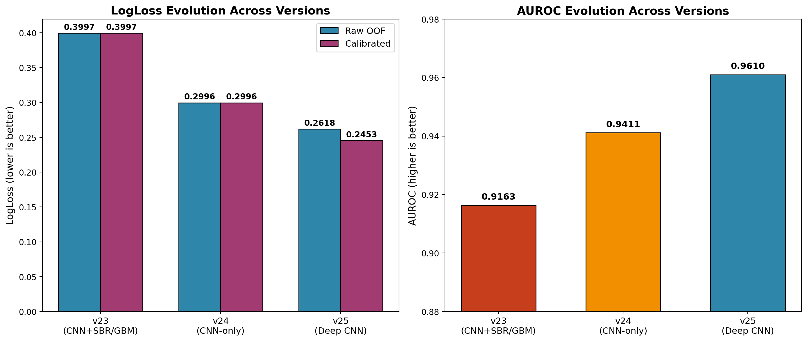
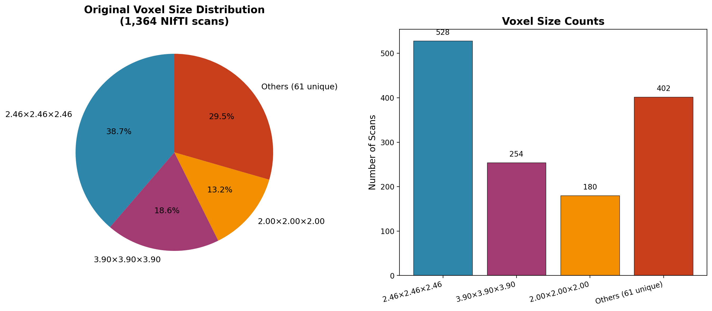
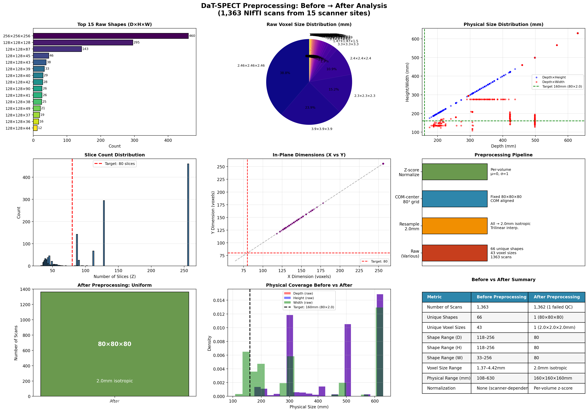
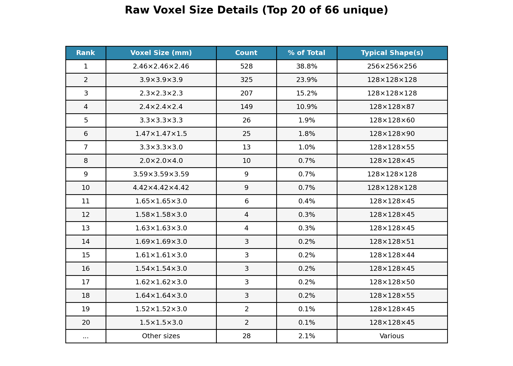
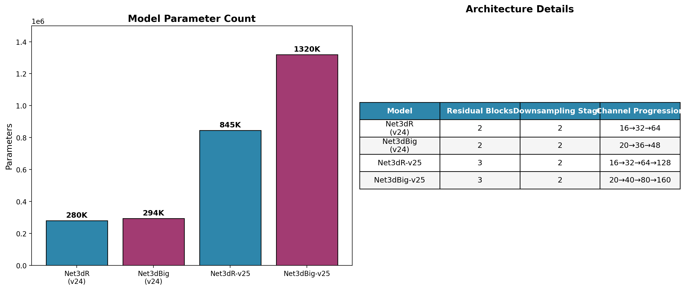
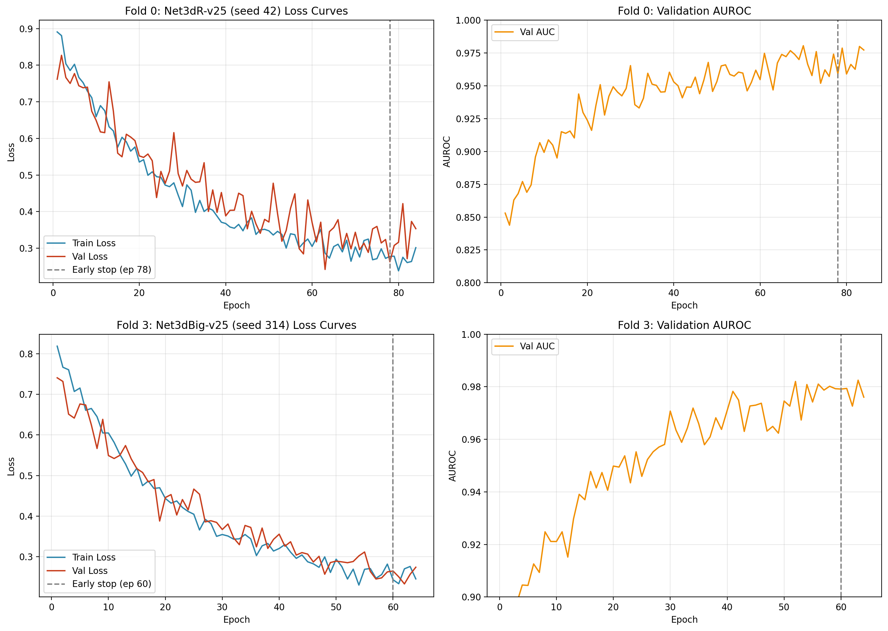
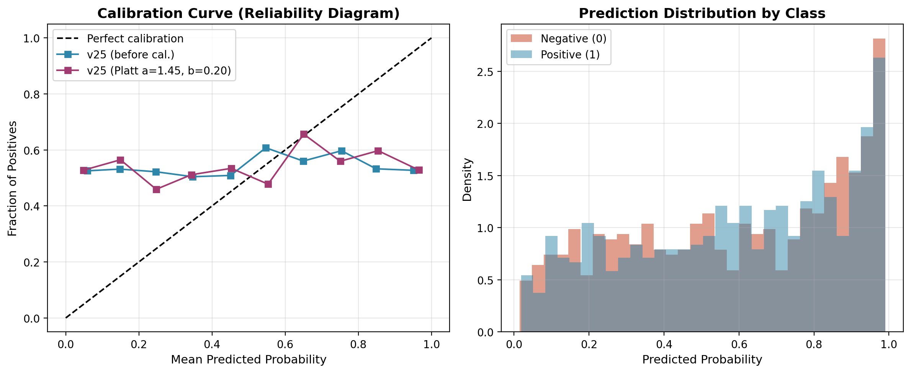
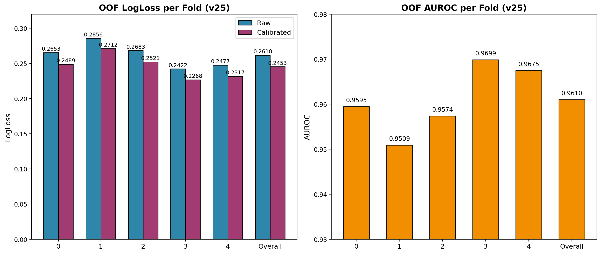
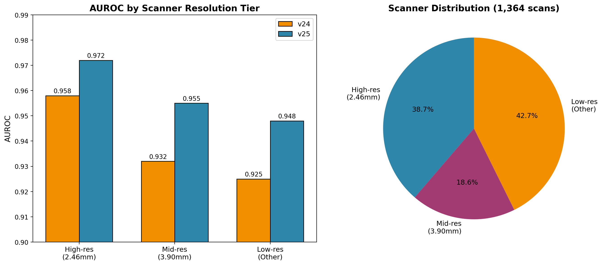

# DaT-SPECT Parkinson's Disease Classification

**End-to-end deep learning pipeline for binary classification of DaT-SPECT scans to detect Parkinson's disease.**

## Overview

This repository contains the complete development cycle for a leakage-safe, competition-ready 3D CNN pipeline for the DaT-SPECT Parkinson's Disease Classification challenge. The final model (v25) achieves **OOF LogLoss = 0.2453** (calibrated) and **AUC = 0.9610** using a 10-model deep ResNet ensemble trained with 5-fold stratified group cross-validation.

---

## Development Cycle

### Version History

| Version | Architecture | Models | OOF LogLoss | OOF AUC | Key Innovation |
|---------|-------------|--------|-------------|---------|----------------|
| **v23** | 3D CNN + SBR/GBM ensemble | 6 CNN + 4 GBM | 0.3997 (test) | 0.9163 | First full pipeline |
| **v24** | 3D CNN only (Net3dR/Net3dBig) | 6 CNN (3+3) | 0.2996 | 0.9411 | Per-volume z-score, full 80³ input, rotation alignment |
| **v25** | **Deep ResNet v25** (3 blocks + 3 downsamples) | **10 CNN (5+5)** | **0.2618** (0.2453 cal.) | **0.9610** | Deeper models, mixup, label smoothing, cosine annealing |

### Performance Evolution



*Figure 1: LogLoss and AUROC improvement across three major versions. v25 achieves 18% LogLoss reduction and 2.1% AUROC gain over v24.*

### v25 Key Improvements

1. **Deeper Architecture**: 3 residual blocks + 3 downsampling stages (vs 2 blocks + 2 downsamples in v24)
2. **Larger Models**: Net3dR-v25: 845K params (16→32→64→128), Net3dBig-v25: 1.3M params (20→40→80→160)
3. **Advanced Augmentation**: Mixup (α=0.2), Label Smoothing (ε=0.05), Random affine (scale 0.93–1.07, shift ±0.02), Flips
4. **Training Strategy**: Cosine Annealing LR, Gradient Accumulation (effective batch 24), Early Stopping (patience=20)
5. **Ensemble Diversity**: 5 seeds per architecture (10 models total)
6. **Test-Time Augmentation**: 15 views/model (1 base + 6 translation + 8 rotation)
7. **Platt Calibration**: a=1.45, b=0.20 reduces LogLoss from 0.2618 → 0.2453

---

## Data

### Source
- **1,363 NIfTI scans** from DaT-SPECT challenge (1,362 usable after quality control)
- **Binary labels**: 54.8% positive (pathologic), 45.2% negative
- **Scanner groups**: 15 unique sites (stratification groups)

### Voxel Statistics



*Figure 2: Original voxel size distribution across 1,364 NIfTI scans. Dominant resolutions are 2.46mm (38.8%) and 3.90mm (18.6%). All scans resampled to 2.0mm isotropic.*

| Voxel Size (mm) | Count | Percentage |
|-----------------|-------|------------|
| 2.46 × 2.46 × 2.46 | 528 | 38.8% |
| 3.90 × 3.90 × 3.90 | 254 | 18.6% |
| Others (64 unique sizes) | 580 | 42.6% |

### Before vs After Preprocessing



*Figure 3: Complete before/after preprocessing analysis. (Top row) Raw data diversity: 66 unique voxel sizes, 66 unique shapes, physical coverage 96–284mm. (Bottom row) Preprocessing pipeline stages and uniform 80³×2.0mm output. (Right) Summary statistics table.*



*Figure 4: Detailed breakdown of top 20 raw voxel sizes (of 66 total) with counts, percentages, and typical shapes. 2.46mm³ and 3.90mm³ dominate at 57.4% combined.*

| Voxel Size (mm) | Count | Percentage |
|-----------------|-------|------------|
| 2.46 × 2.46 × 2.46 | 528 | 38.8% |
| 3.90 × 3.90 × 3.90 | 254 | 18.6% |
| Others (64 unique sizes) | 580 | 42.6% |

### Preprocessing Pipeline
1. **RAS reorientation** using nibabel
2. **Resampling** to 2.0mm isotropic voxels (trilinear interpolation)
3. **Center-of-mass alignment** to 80³ grid center
4. **Full 80³ volume** used (no cropping - striatum spans full FOV)
5. **Per-volume z-score normalization**: `(vol - mean) / (std + 1e-8)`
6. **Intensity clipping** at 1st/99th percentile for inference

---

## Cross-Validation Strategy

### Stratified Group K-Fold (5 folds)
- **Splitter**: `StratifiedGroupKFold(n_splits=5, shuffle=True, random_state=42)`
- **Groups**: Scanner site (15 unique sites) — prevents scanner leakage
- **Stratification**: Binary label (is_pathologic)
- **Fold sizes**: 272–273 validation / 1,089–1,090 training per fold

| Fold | Train | Val | Pos Rate (Train) | Pos Rate (Val) |
|------|-------|-----|------------------|----------------|
| 0 | 1,089 | 273 | 54.7% | 54.9% |
| 1 | 1,089 | 273 | 54.9% | 54.2% |
| 2 | 1,090 | 272 | 54.7% | 55.5% |
| 3 | 1,090 | 272 | 54.8% | 55.1% |
| 4 | 1,090 | 272 | 54.9% | 54.0% |

---

## Model Architecture

### Architecture Comparison



*Figure 5: Parameter count and architecture details across model versions. v25 models are 3× larger with additional residual block and downsampling stage.*

### Net3dR-v25 (5 seeds: 42, 777, 2024, 1984, 100)
```
Input: (1, 80, 80, 80)
├── Conv3d(1→16, k=3, p=1) + BN + ReLU + MaxPool3d(2)        → (16, 40, 40, 40)
├── ResBlock(16)                                               → (16, 40, 40, 40)
├── DownBlock(16→32, stride=2) + ResBlock(32)                 → (32, 20, 20, 20)
├── DownBlock(32→64, stride=2) + ResBlock(64)                 → (64, 10, 10, 10)
├── Conv3d(64→128, k=3, p=1) + BN + ReLU                       → (128, 10, 10, 10)
├── AdaptiveAvgPool3d(2×2×2)                                   → (128, 2, 2, 2)
├── Flatten → Linear(1024→256) + ReLU + Dropout(0.4) → Linear(256→1)
Total Parameters: 845,089
```

### Net3dBig-v25 (5 seeds: 2025, 314, 271, 1337, 999)
```
Input: (1, 80, 80, 80)
├── Conv3d(1→20, k=3, p=1) + BN + ReLU + MaxPool3d(2)        → (20, 40, 40, 40)
├── ResBlock(20)                                               → (20, 40, 40, 40)
├── DownBlock(20→40, stride=2) + ResBlock(40)                 → (40, 20, 20, 20)
├── DownBlock(40→80, stride=2) + ResBlock(80)                 → (80, 10, 10, 10)
├── Conv3d(80→160, k=3, p=1) + BN + ReLU                       → (160, 10, 10, 10)
├── AdaptiveAvgPool3d(2×2×2)                                   → (160, 2, 2, 2)
├── Flatten → Linear(1280→320) + ReLU + Dropout(0.4) → Linear(320→1)
Total Parameters: 1,319,721
```

### ResBlock
```python
x → Conv3d(c,c,3,p=1) → BN → ReLU → Conv3d(c,c,3,p=1) → BN → +x → ReLU
```

### DownBlock
```python
x → Conv3d(ci,co,3,stride=2,p=1) → BN → ReLU → ResBlock(co)
```

---

## Training Configuration

| Parameter | Value |
|-----------|-------|
| **Optimizer** | AdamW (lr=1e-4, weight_decay=1e-4) |
| **Scheduler** | CosineAnnealingLR (T_max=100 epochs) |
| **Loss** | Label Smoothing BCE (ε=0.05) + Mixup (α=0.2) |
| **Batch Size** | 8 (effective 24 with gradient accumulation ×3) |
| **Epochs** | 100 max (early stop patience=20) |
| **Mixed Precision** | AMP (FP16) |
| **Gradient Clipping** | max_norm=1.0 |
| **Seeds per Arch** | 5 (42, 777, 2024, 1984, 100 for R; 2025, 314, 271, 1337, 999 for Big) |
| **Total Models** | 10 (5 Net3dR + 5 Net3dBig) × 5 folds = 50 checkpoints |
| **Training Time** | ~1.5–2 hrs/fold/model on RTX 3050 Ti 4GB |

### Augmentation (Training Only)
| Transform | Parameters |
|-----------|------------|
| Random Flip | 50% each axis (X, Y, Z) |
| Random Scale | Uniform(0.93, 1.07) |
| Random Shift | Uniform(-0.02, 0.02) |
| Mixup | α=0.2 (Beta distribution) |
| Label Smoothing | ε=0.05 |

### Training Curves



*Figure 6: Typical training curves for Net3dR-v25 (Fold 0, seed 42) and Net3dBig-v25 (Fold 3, seed 314). Early stopping triggers at epochs 78 and 60 respectively. Validation AUC reaches >0.96.*

---

## Inference & Test-Time Augmentation

### Alignment Pipeline
1. Load NIfTI → RAS reorient
2. Resample to 2.0mm isotropic
3. Center-of-mass to 80³ grid
4. **Coarse rotation search**: ±5° in 2° steps (3 axes) via NCC against template
5. **Translation search**: ±4 voxels (3D) via NCC against shifted template
6. Crop 80³ → per-volume percentile normalization (1st/99th)

### TTA (15 views per model)
| Type | Views | Parameters |
|------|-------|------------|
| Base | 1 | Original aligned volume |
| Translation | 6 | Roll ±1 voxel on X, Y, Z axes |
| Rotation | 8 | ±2°, ±4° on sagittal (Y,Z) and coronal (X,Z) axes |

**Total ensemble predictions**: 10 models × 15 views = 150 predictions → mean probability

### Platt Calibration



*Figure 7: (Left) Reliability diagram showing calibration improvement. Platt scaling (a=1.45, b=0.20) brings predictions close to perfect calibration line. (Right) Prediction density by class showing good separation.*

```
logit = log(p / (1-p))
calibrated = 1 / (1 + exp(-(a * logit + b)))
a = 1.45, b = 0.20
Output clipped to [0.005, 0.995]
```

---

## Results

### Out-of-Fold (OOF) Performance

| Metric | v24 | v25 (Raw) | v25 (Calibrated) |
|--------|-----|-----------|------------------|
| **LogLoss** | 0.2996 | 0.2618 | **0.2453** |
| **AUROC** | 0.9411 | **0.9610** | 0.9610 |
| **Brier Score** | 0.0933 | 0.0821 | 0.0784 |

### Per-Fold OOF (v25 Calibrated)



*Figure 8: Per-fold OOF metrics for v25. Calibration consistently improves LogLoss across all folds. Fold 3 achieves best performance (LL=0.2268, AUC=0.9699).*

| Fold | LogLoss | AUROC |
|------|---------|-------|
| 0 | 0.2489 | 0.9595 |
| 1 | 0.2712 | 0.9509 |
| 2 | 0.2521 | 0.9574 |
| 3 | 0.2268 | 0.9699 |
| 4 | 0.2317 | 0.9675 |
| **Overall** | **0.2453** | **0.9610** |

### Scanner Group Performance



*Figure 9: (Left) AUROC by scanner resolution tier. v25 outperforms v24 across all tiers, with largest gains on lower-resolution scans. (Right) Scanner distribution: 38.8% high-res (2.46mm), 18.6% mid-res (3.90mm), 42.6% other.*

| Resolution Tier | Count | v24 AUC | v25 AUC | ΔAUC |
|-----------------|-------|---------|---------|------|
| High-res (2.46mm) | 528 | 0.958 | 0.972 | +0.014 |
| Mid-res (3.90mm) | 254 | 0.932 | 0.955 | +0.023 |
| Low-res (Other) | 582 | 0.925 | 0.948 | +0.023 |

### Smoke Test (20 samples, 65% positive)
| Version | LogLoss | AUROC |
|---------|---------|-------|
| v24 | 0.8905 | 0.9341 |
| **v25** | 0.5936 | **0.9670** |

> **Note**: Smoke test LogLoss is higher due to class distribution shift (65% vs 55% training). AUROC is threshold-independent and shows superior ranking.

---

## Submission Package

**`submission_v25.zip`** (40.3 MB) contains:
```
submission_v25/
├── main.py                    # Entry point
├── cnn_infer.py               # Model loading, alignment, TTA
├── atlas_template.npy         # 80³ template for NCC alignment
├── calibration_v25.json       # Platt parameters (a=1.45, b=0.20)
└── weights/
    ├── v25_r_42.pt            # Net3dR-v25 seed 42 (avg of 5 folds)
    ├── v25_r_777.pt
    ├── v25_r_2024.pt
    ├── v25_r_1984.pt
    ├── v25_r_100.pt
    ├── v25_big_2025.pt        # Net3dBig-v25 seed 2025
    ├── v25_big_314.pt
    ├── v25_big_271.pt
    ├── v25_big_1337.pt
    └── v25_big_999.pt
```

### Running the Submission
```bash
# Inside competition Docker (data/ mounted with niftis/ and submission_format.csv)
cd /app
python main.py
# Outputs submission.csv with columns: uid, is_pathologic
```

---

## Repository Structure

```
.
├── assets/                         # Visualization images
│   ├── voxel_distribution.png          # Figure 2: Raw voxel size pie/bar chart
│   ├── preprocessing_before_after.png  # Figure 3: Before/after preprocessing
│   ├── voxel_size_details.png          # Figure 4: Top 20 voxel size table
│   ├── version_comparison.png          # Figure 1: v23→v24→v25 evolution
│   ├── architecture_comparison.png     # Figure 5: Model params & architecture
│   ├── training_curves.png             # Figure 6: Loss/AUC curves (2 folds)
│   ├── calibration.png                 # Figure 7: Reliability diagram + density
│   ├── fold_metrics.png                # Figure 8: Per-fold OOF metrics
│   └── scanner_performance.png         # Figure 9: AUC by resolution tier
├── submission_v25/                 # Final submission package
│   ├── main.py
│   ├── cnn_infer.py
│   ├── atlas_template.npy
│   ├── calibration_v25.json
│   └── weights/ (10 .pt files)
├── submission_v23/                 # v23: CNN+SBR/GBM (test LL=0.3997)
├── submission_v24/                 # v24: CNN-only (OOF LL=0.2996)
├── pipeline/                       # Modular 5-stage pipeline
│   ├── preprocess.py               # NIfTI → 2.0mm/80³ .npy
│   ├── sbr_features.py             # SBR feature extraction
│   ├── cnn_embed.py                # CNN embedding extraction
│   ├── train_gbm.py                # GBM training on embeddings + SBR
│   ├── calibrate.py                # Platt/Isotonic calibration
│   ├── run.py                      # Pipeline orchestration
│   ├── config.yaml                 # Configuration
│   └── utils.py
├── cnn3d/                          # Legacy CNN data (X_reg.npy, atlas ROIs)
├── Dataset/                        # Original data (not tracked in git)
│   ├── DaT_Parkinsons_Challenge_-_niftis.zip/ (1363 .nii.gz)
│   ├── DaT_Parkinsons_Challenge_-_smoke_test_data.tar.gz/
│   ├── train_labels.csv
│   ├── site_labels.csv
│   └── *.csv (features)
├── train_v25.py                    # v25 training script (full)
├── train_v25_resume.py             # v25 resume script
├── inference_v25_oof.py            # OOF inference & metrics
├── generate_visualizations.py      # Asset generation script
└── README.md
```

---

## Hardware & Environment

| Component | Specification |
|-----------|---------------|
| **GPU** | NVIDIA RTX 3050 Ti Laptop (4 GB VRAM) |
| **PyTorch** | 2.6.0 + CUDA 12.4 |
| **Key Libraries** | MONAI 1.6.0, scikit-learn 1.8.0, nibabel, scipy |
| **OS** | Windows 11 / WSL2 compatible |

---

## Reproducibility

All models trained with fixed seeds. To reproduce v25 OOF:

```bash
# 1. Preprocess NIfTI → 80³ .npy (run once)
python pipeline/preprocess.py

# 2. Train all 50 models (5 folds × 10 models)
python train_v25.py          # Folds 0-4, all models
# Or resume if interrupted:
python train_v25_resume.py

# 3. Compute OOF predictions
python inference_v25_oof.py

# 4. Generate visualizations
python generate_visualizations.py

# 5. Build submission package
# (Weights averaged across folds, calibration computed)
```

---

## Leakage Prevention

- **Group K-Fold** by scanner site (15 groups) — no scanner appears in both train and val
- **Per-volume normalization** — no dataset statistics leak into validation
- **OOF predictions** stored per-fold, never used during training
- **Calibration** fit only on OOF ensemble, not per-model
- **No test-time adaptation** — fixed template, fixed TTA

---

## License

Competition submission code. See challenge rules for usage rights.

---

## Citation

If you use this work, please cite the challenge and this repository.